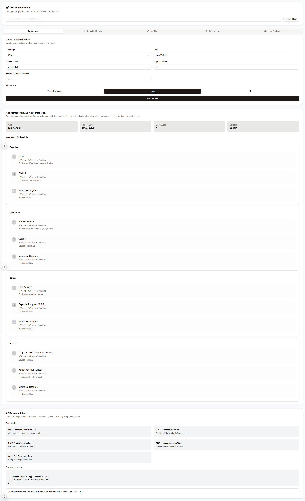

# AI Workout Planner



A modern, AI-powered workout planning application that helps users create personalized workout plans, get exercise details, nutrition advice, and analyze food plates.

## Features

- **Workout Plan Generation**: Create personalized workout plans based on your goals, fitness level, and preferences
- **Exercise Details**: Get detailed information about specific exercises, including proper form and muscle groups targeted
- **Nutrition Advice**: Receive personalized nutrition recommendations based on your goals and dietary restrictions
- **Custom Plans**: Create highly customized workout plans with specific goals and health considerations
- **Food Analysis**: Analyze food plates through image upload for nutritional content
- **Multi-language Support**: Available in 30 languages including:
  - English
  - Türkçe
  - Español
  - Français
  - And many more...

## Tech Stack

- Next.js 13+
- TypeScript
- Tailwind CSS
- shadcn/ui Components
- RapidAPI Integration

## Getting Started

### Prerequisites

- Node.js 16.8 or later
- npm or yarn
- RapidAPI Key for the AI Workout Planner API

### Getting RapidAPI Key

1. Visit [AI Workout Planner API on RapidAPI](https://rapidapi.com/ltdbilgisam/api/ai-workout-planner-exercise-fitness-nutrition-guide)
2. Click the "Subscribe to Test" button
3. Sign up for a RapidAPI account if you don't have one
4. Choose a subscription plan (there's a free tier available)
5. Once subscribed, you'll find your API key in:
   - The "Header Parameters" section as `X-RapidAPI-Key`
   - Your RapidAPI Dashboard under "Security"
6. Copy this API key for use in the application

### Installation

1. Clone the repository:
```bash
git clone https://github.com/smtkuo/ai-workout-planner.git
cd ai-workout-planner
```

2. Install dependencies:
```bash
npm install
# or
yarn install
```

3. Start the development server:
```bash
npm run dev
# or
yarn dev
```

4. Open [http://localhost:3000](http://localhost:3000) in your browser.

## API Documentation

The application uses the following endpoints from the AI Workout Planner API:

- `POST /generateWorkoutPlan`: Generate personalized workout plans
- `POST /exerciseDetails`: Get detailed exercise information
- `POST /nutritionAdvice`: Get personalized nutrition recommendations
- `POST /customWorkoutPlan`: Create custom workout plans
- `POST /analyzeFoodPlate`: Analyze food images for nutritional content

## Usage

1. **Generate Workout Plan**:
   - Select your preferred language
   - Choose your fitness goal
   - Set your fitness level
   - Specify days per week and session duration
   - Select workout preferences
   - Click "Generate Plan"

2. **Get Exercise Details**:
   - Enter the exercise name
   - Select your language
   - Get detailed instructions and muscle group information

3. **Nutrition Advice**:
   - Set your nutrition goals
   - Enter current and target weights
   - Specify dietary restrictions
   - Get personalized meal plans

4. **Custom Plans**:
   - Create highly customized workout plans
   - Add specific health conditions
   - Set custom goals
   - Get tailored exercise recommendations

5. **Food Analysis**:
   - Upload food images
   - Get detailed nutritional breakdown
   - View health insights and dietary information

## Contributing

1. Fork the repository
2. Create your feature branch (`git checkout -b feature/AmazingFeature`)
3. Commit your changes (`git commit -m 'Add some AmazingFeature'`)
4. Push to the branch (`git push origin feature/AmazingFeature`)
5. Open a Pull Request

## License

This project is licensed under the MIT License - see the [LICENSE](LICENSE) file for details.

## Acknowledgments

- RapidAPI for providing the AI Workout Planner API
- shadcn/ui for the beautiful UI components
- Next.js team for the amazing framework

### Local Production Build

To create a production build locally:

```bash
npm run build
# or
yarn build
```

The static files will be generated in the `out` directory.
